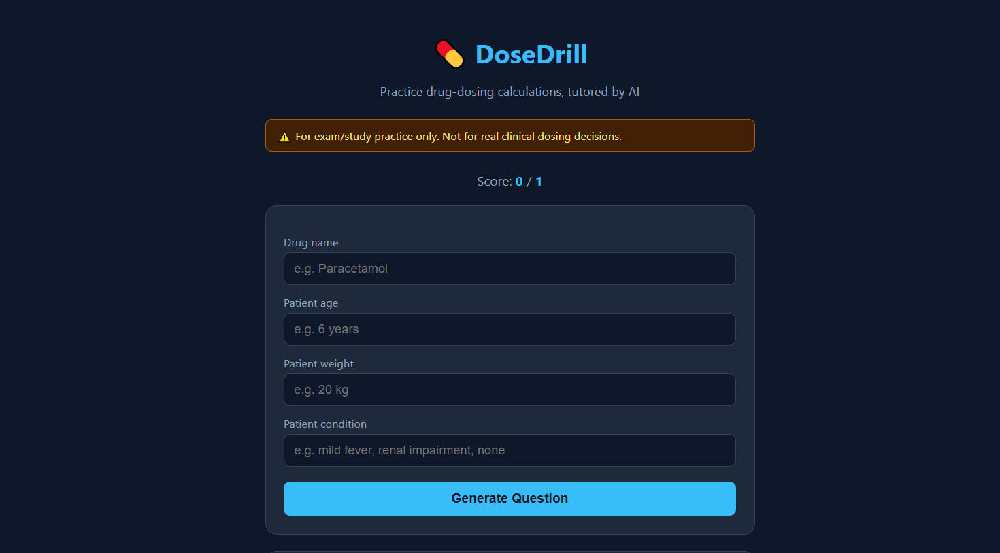
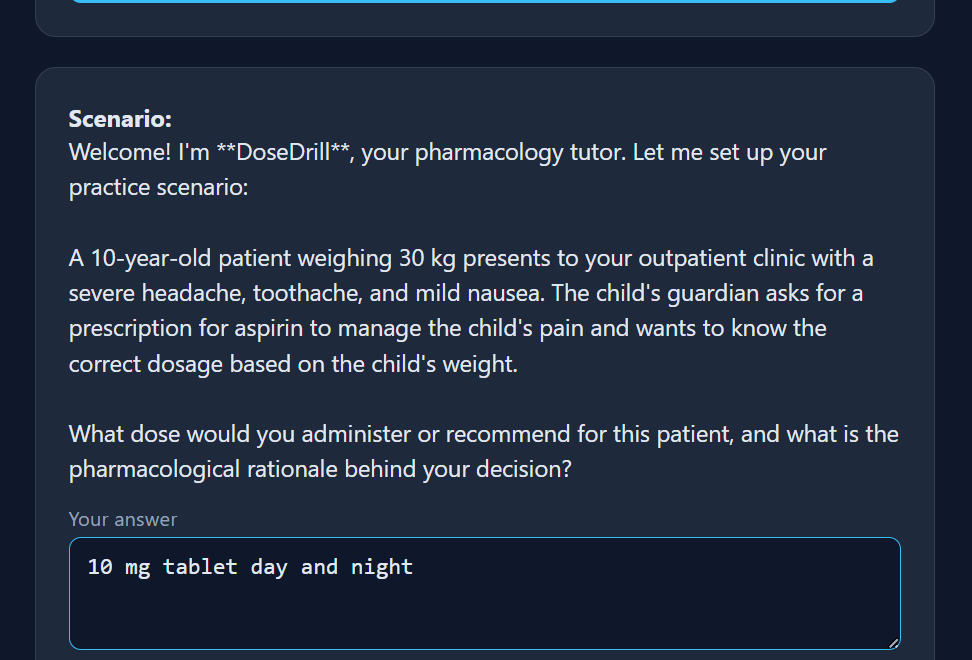
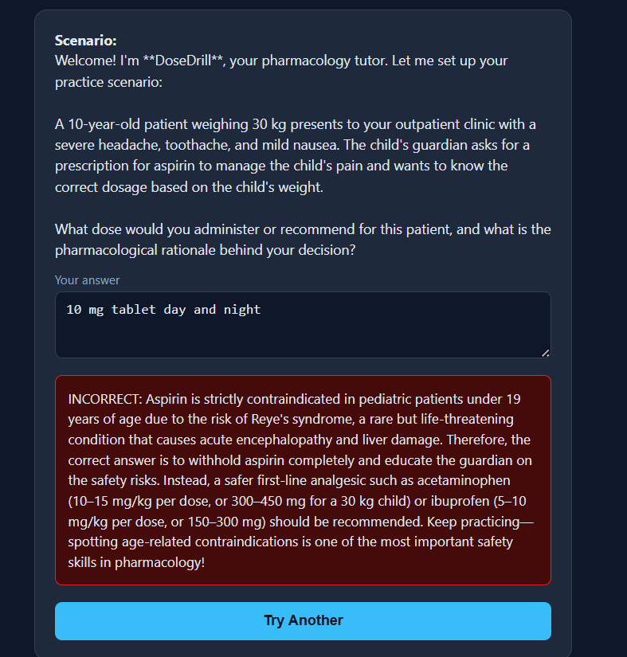
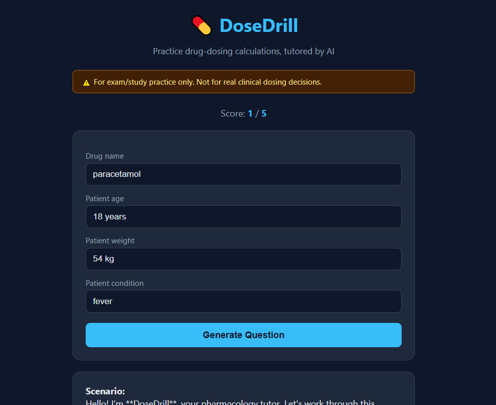

# 💊 DoseDrill

### An AI-powered drug dosing practice tool for medical and nursing students

---

## a. What it does & the problem it solves

**DoseDrill** is a web app that helps medical and nursing students practice calculating drug doses through active recall, rather than passively reading dosing charts.

**The problem:** Pharmacology dosing calculations are one of the most commonly missed topics in medical school exams and early clinical practice. Students often memorize dosing rules without truly practicing the calculation itself, especially the way a patient's **condition** (renal impairment, hepatic impairment, pregnancy, age-related factors, etc.) changes the correct dose.

**Who it's for:** Medical and nursing students (like myself, at Rawalpindi Medical University) preparing for exams, vivas, or clinical rotations who want quick, repeatable dosing practice with instant feedback.

**How it works:** The student enters a drug name and a patient scenario (age, weight, and condition). The AI generates a realistic dosing question, the student answers it, and the AI grades the answer with a clear explanation — including how the patient's condition affected the correct dose.

---

## b. Live URL

🔗 **[https://dose-drill.vercel.app](https://dose-drill.vercel.app)**

Anyone can open this link and use the app directly — no login required.

---

## c. Features

- Enter a drug name + patient age, weight, and condition
- AI generates a realistic, unique dosing practice scenario based on the exact inputs
- Type your own answer/reasoning for the correct dose
- AI grades the answer as ✅ Correct or ❌ Incorrect, with a clear explanation of the right dose and reasoning
- Explanation specifically accounts for how the patient's **condition** affects dosing (a common thing students overlook)
- Persistent score counter (e.g. "Score: 4/6") that tracks performance across the whole session
- "Try Another" button to keep practicing with new scenarios instantly
- Clear on-screen disclaimer that this is a study tool, not a real clinical dosing reference

---

## d. The AI feature

DoseDrill's core feature *is* the AI — it acts as a pharmacology tutor with two jobs, each driven by a specific system prompt I wrote:

**1. Generating a practice question**
```
You are DoseDrill, a friendly and rigorous pharmacology tutor for medical and nursing students.
Your job is to generate ONE realistic drug-dosing practice scenario for a student to solve.

Rules:
- Use the drug, age, weight, and medical condition provided by the student.
- The condition is critical — factor in how it would affect dosing (e.g. renal impairment, hepatic impairment, pregnancy, pediatric considerations, allergies) if relevant.
- Present the scenario clearly and ask the student to calculate/state the correct dose.
- Do NOT reveal the correct answer yet. Only ask the question.
- Keep it realistic but concise (3-5 sentences).
- This is an EDUCATIONAL practice tool, not real clinical guidance. Do not imply this should be used to dose an actual patient.
- End with a clear question like: "What dose would you administer, and how did you calculate it?"
```

**2. Grading the student's answer**
```
You are DoseDrill, a friendly and rigorous pharmacology tutor for medical and nursing students.
You previously gave the student a dosing scenario. Now grade their answer.

Rules:
- Determine the clinically appropriate dose/reasoning for the scenario given (considering age, weight, and especially the medical condition).
- Compare it to the student's answer.
- Start your reply with either "CORRECT:" or "INCORRECT:" (all caps, exact word).
- Then explain the correct dose and the reasoning clearly, in 3-5 sentences, including how the condition affected the calculation.
- Be encouraging but accurate. This is a study tool — clarity and correctness matter most.
- Do not imply this should be used for real patient care.
```

These prompts are the actual instructions sent to the AI model on every request — see `api/dosedrill.js` in this repo.

---

## e. Tools, services, and AI models used

- **AI Model:** Google Gemini (`gemini-3.6-flash`) via the Gemini API — powers both question generation and answer grading
- **Hosting/Deployment:** Vercel (serverless functions + static hosting)
- **Version Control:** GitHub (public repository)
- **Frontend:** Plain HTML, CSS, and JavaScript (no framework)
- **Backend:** A single Vercel serverless function (Node.js) that securely calls the Gemini API

---

## f. Screenshots

**Home screen**



**AI-generated dosing question**



**AI feedback on student's answer**



**Score tracking across a session**



---

## g. How to run this project locally

1. Clone the repository:
   ```
   git clone https://github.com/ayesha-hassan04/DoseDrill.git
   cd DoseDrill
   ```
2. Get a free Gemini API key from [Google AI Studio](https://aistudio.google.com) (no credit card required).
3. Create a `.env` file in the project root with:
   ```
   GEMINI_API_KEY=your_key_here
   ```
4. Install the Vercel CLI and run locally:
   ```
   npm install -g vercel
   vercel dev
   ```
5. Open the local URL shown in your terminal (usually `http://localhost:3000`).

**Note:** No API keys are committed to this repository. The `GEMINI_API_KEY` is stored securely as an environment variable on Vercel for the live deployment.

---

## ⚠️ Disclaimer

DoseDrill is an **educational practice tool only**. It is not intended for real clinical dosing decisions. Always refer to verified clinical guidelines and supervising professionals for actual patient care.
